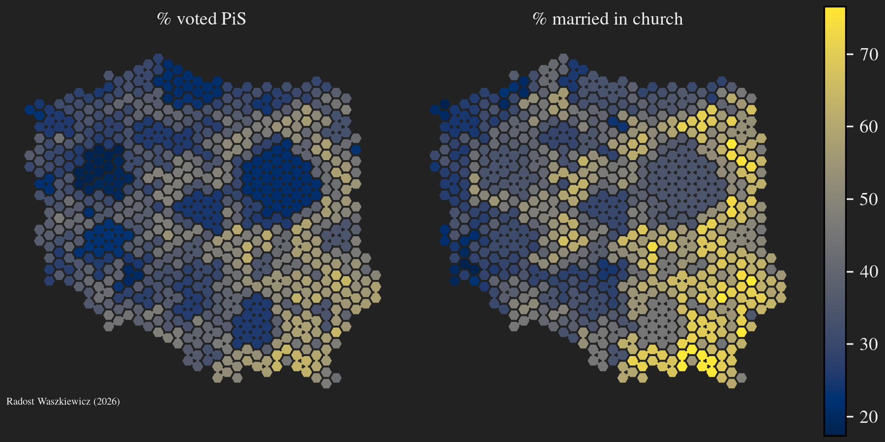

# Secularisation as a driver of single axis political conflict: evidence from Poland.

<p align="center">
  
  <div align="center" style="font-style: italic;">Values given by powiat. One hexagon represents approximately 50 thousand people.</div>
</p>

## Abstract

*This repository accompanies a publication of the same title.*

This study examines how regionally heterogeneous secularisation can increase the saliency of religion as a determinant of political behaviour. Changes in the electoral outcomes in Poland over the last 25 years are discussed in a comparative setting, where the regional variation of election results is compared with that of Germany, France, Italy, and Spain. When placed against the backdrop of major European democracies, Poland emerges as an outlier where, over time, the voting outcomes align along a single dimension of conflict without a corresponding reduction in the effective number of parties. The source of the atypical behaviour is sought in the trajectory of secularisation, which is analysed with regionally resolved civil and religious marriage counts, with Italy and Spain (Catholic countries with religious-civil marriage equivalence) used for comparison. The direct negative effect of secularisation on the outcome of right-wing parties, studied in a two-way fixed effects design (around 6 percentage points in the period of study), is compared with an overall rise in significance of religion using a variance decomposition approach (changing from 20\% to 68\% of explained variance). The results show that common descriptions of the rise of populist support in response to increasing economic inequality are founded on a religious monolith assumption which crumbled over the last decades.

## Sources

| File                    | Description                           | Source |
| ----------------------- | ------------------------------------- | ------ |
| italy__votes.csv        | vote counts                           | [1]    |
| spain__votes.csv        | vote counts                           | [1]    |
| poland__votes.csv       | vote counts                           | [1]    |
| italy__marriages.csv    | civil and religious marriage counts   | [2]    |
| spain__marriages.csv    | civil and religious marriage counts   | [2]    |
| poland__marriages.csv   | civil and religious marriage counts   | [2]    |
| italy__incomes.zip      | income data based on pension records  | [3]    |
| italy__regions.csv      | region names and codes                | [4]    |
| italy__alignment.yaml   | party coalition alignment             | [5]    |
| spain__incomes.csv      | income data based on tax records      | [6]    |
| spain__regions.csv      | region names and codes                | [7]    |
| poland__incomes.csv     | income data (national statistics)     | [8]    |
| poland__ess_raw.csv     | European Social Survey data           | [9]    |

- [1] : own work based on election results regiters - [github.com/RadostW/europe-elections](https://github.com/RadostW/europe-elections)
- [2] : own work based on national databases - [github.com/RadostW/europe-marriages](https://github.com/RadostW/europe-marriages)
- [3] : salary levels in years 1990-2021, social security institute elaboration - [inps.it (open data portal)](https://www.inps.it/it/it/dati-e-bilanci/open-data/scarica-gli-open-data/dettaglio-opendata.opendata.2023.05.5845.livelli-salariali-nel-periodo-1990-2021.html)
- [4] : ISTAT codes table - [istat.it (admin. codes archive)](https://www.istat.it/storage/codici-unita-amministrative/Elenco-comuni-italiani.csv)
- [5] : own work based on wikipedia, coalitions as presented in election results, only parties above 2% support
- [6] : personal incomes based on personal income tax data (modelo 190) by ministry of interior - [sede.agenciatributaria.gob.es (raw data portal)](https://sede.agenciatributaria.gob.es/Sede/estadisticas/anuario-estadistico/acceso-descarga-masiva-datos.html)
- [7] : own work based on nuts tables and ine codes tables.
- [8] : mean income in relation to the country average, national statistics office, local data bank - [bdl.stat.gov.pl (dataset builder)](https://bdl.stat.gov.pl/bdl/dane/podgrup/wymiary/40/403/2497)
- [9] : extract of European Social Survey - see [ESS data portal](https://ess.sikt.no/) for more info.

## How to cite

*Secularisation as a driver of single axis political conflict: evidence from Poland* Radost Waszkiewicz (2026)

```bibtex
@misc{Waszkiewicz_2026,
  author       = {Waszkiewicz, Radost},
  title        = {Secularisation as a driver of single axis political conflict: evidence from Poland},
  year         = {2026},
  howpublished = {\url{https://github.com/RadostW/secularisation-polarisation}},
  note         = {GitHub repository},  
}
```

## License

All software in this repository is licensed under GPL v 3.0 or later.

Copyright (C) 2026 Radost Waszkiewicz

Raw datasets are made available by national agencies. 
Derived datasets are licensed under CC-BY-SA 4.0, or CC-BY-SA 3.0, or GPL v 3.0 or later, at the users choice.
